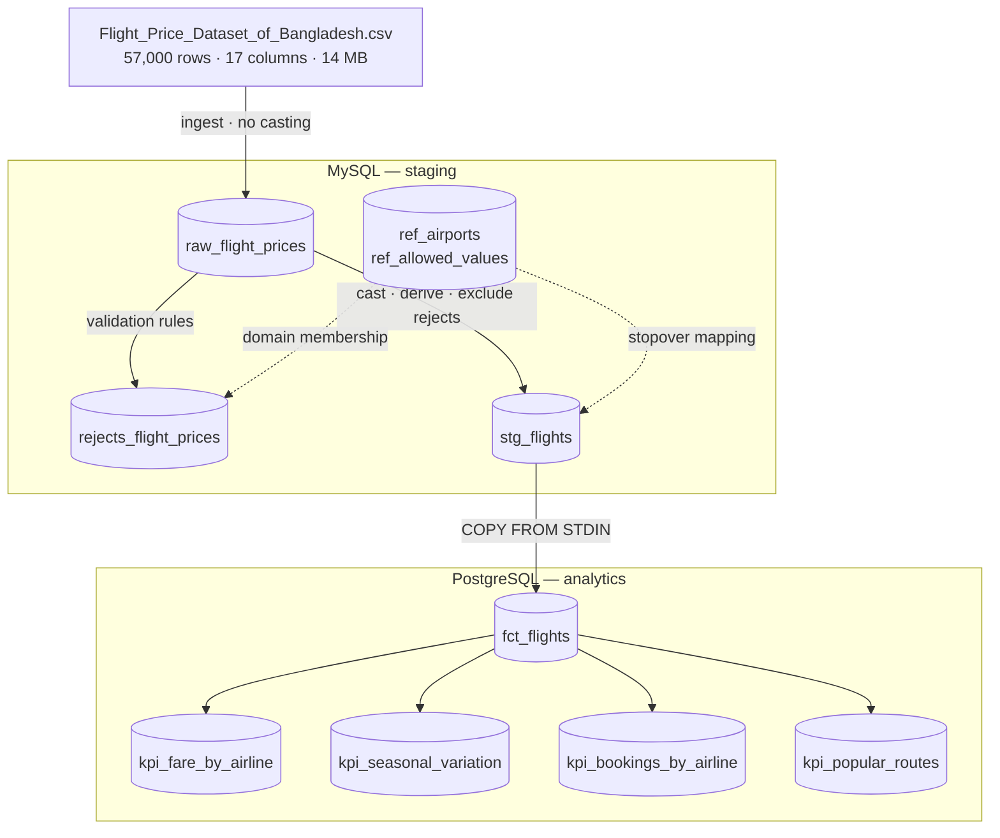

# Flight Price Analysis — Airflow Pipeline

CSV → MySQL staging → validation → PostgreSQL analytics → KPI marts, over the
*Flight Price Dataset of Bangladesh* (57,000 rows) from Kaggle. Airflow 3.3.1 on
LocalExecutor, entirely in Docker.

> 📄 **[Full project report → `docs/REPORT.md`](docs/REPORT.md)**  — architecture,
> task-by-task design, KPI definitions and results, data findings, challenges
> resolved.
---

## Quickstart

```bash
make init                 # .env with freshly generated secrets + your uid
make build                # build the extended Airflow image 
make up                   # start the stack
make ps                   # wait until services report healthy
```

Airflow UI → <http://localhost:8080>.

```bash
make logs S=airflow-scheduler   # tail one service
make mysql / make psql          # shell into staging / analytics
make q  SQL="SELECT ..."        # one-off query on analytics
make qm SQL="SELECT ..."        # one-off query on staging
make test                       # test suite
make integration                # end-to-end run + assertions
make down / make clean          # stop / stop and wipe volumes
```

Every row carries a `batch_id` — the Airflow `run_id`:

```bash
make q SQL="SELECT batch_id, COUNT(*) FROM fct_flights GROUP BY batch_id"
```

Only one batch exists at a time: every layer is a full refresh, so `batch_id`
records *which run produced a row*, not a history to partition on.

---

## Architecture


Two separate databases are in this architecture — Mysql for staging and Postgresql as the analytic database. All these orchestrated by Airflow

---

## Design decisions

**Land as TEXT, cast later.** 

**Quarantine, never drop.** 

**Every task is re-runnable.**

**SQL for transformation, Airflow Python for orchestration.** 

**Tunables lives in config files.** 


---

## Tests

```bash
make test          # 41 tests
make integration    # end-to-end against real databases
make lint           # same rules CI enforces
```

`tests/unit/` (32 tests) imports no Airflow ,
which is what lets CI check logic without building the image. 

---

## Layout

```
pyproject.toml    package metadata, ruff + pytest config
dags/             wiring only 
src/flight_pipeline/
  config.py       typed access to pipeline.yml
  schema.py       column contracts
  ingest.py       CSV load + reference seeding
  transfer.py     MySQL -> PostgreSQL COPY
  checks.py       gate decisions
include/
  data/raw/       bulk source — gitignored
  data/reference/ curated lookup data — tracked, read by every run
  data/fixtures/  deliberately broken input — tracked, test material only
  sql/mysql/      staging DDL + transformations
  sql/postgres/   analytics DDL + KPI queries
tests/            unit/ (no Airflow) · dag/ (needs Airflow)
scripts/          integration_test.sh
docs/             project report
.github/          CI: lint+unit · DAG structure · end-to-end integration
```

---

## Troubleshooting

**Port already allocated** — Change
`MYSQL_HOST_PORT` / `POSTGRES_HOST_PORT` in `.env`.


**DAG not appearing** — `make dag-test` shows import errors the UI hides.


**Run won't start / stuck** — a previously failed run may hold the single
active-run slot: `airflow dags delete flight_price_pipeline -y`, then
reserialize and unpause.
