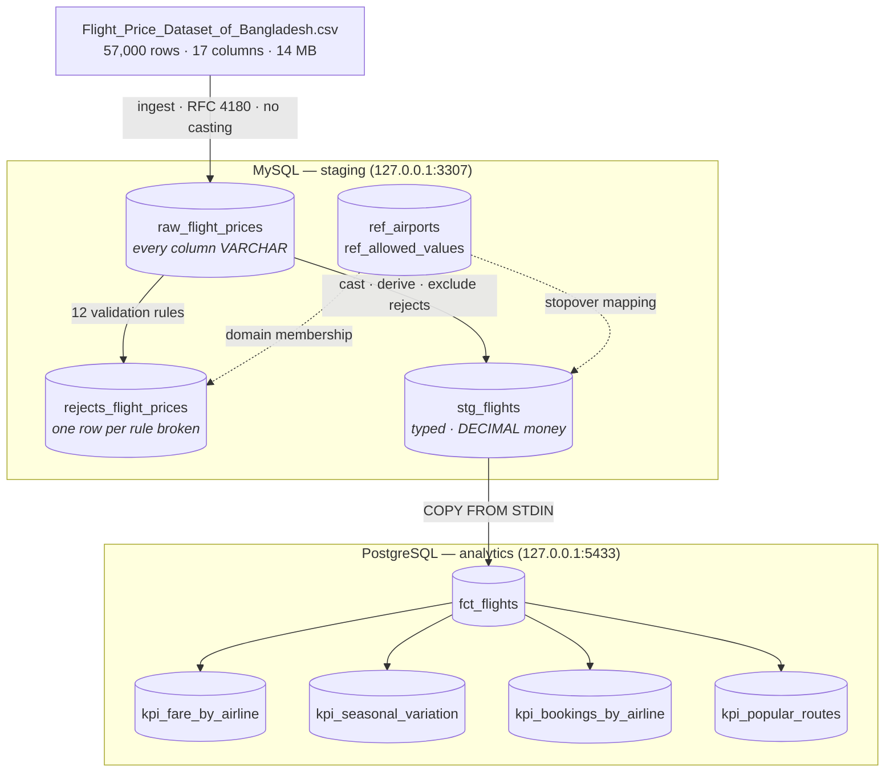

# Flight Price Analysis — Airflow Pipeline

CSV → MySQL staging → validation → PostgreSQL analytics → KPI marts, over the
*Flight Price Dataset of Bangladesh* (57,000 rows). Airflow 3.3.1 on
LocalExecutor, entirely in Docker.

> 📄 **[Full project report → `docs/REPORT.md`](docs/REPORT.md)** — architecture,
> task-by-task design, KPI definitions and results, data findings, challenges
> resolved. This README is the operating manual only.

---

## Quickstart

```bash
make init                 # .env with freshly generated secrets + your uid
make build                # build the extended Airflow image (once, ~3 min)
make up                   # start the stack
make ps                   # wait until services report healthy
```

Airflow UI → <http://localhost:8080> (`airflow` / `airflow`, loopback only).

```bash
make logs S=airflow-scheduler   # tail one service
make mysql / make psql          # shell into staging / analytics
make q  SQL="SELECT ..."        # one-off query on analytics
make qm SQL="SELECT ..."        # one-off query on staging
make test                       # test suite
make integration                # end-to-end run + assertions
make down / make clean          # stop / stop and wipe volumes
```

Every row carries a `batch_id` — the Airflow `run_id`, copied verbatim:

```bash
make q SQL="SELECT batch_id, COUNT(*) FROM fct_flights GROUP BY batch_id"
```

Only one batch exists at a time: every layer is a full refresh, so `batch_id`
records *which run produced a row*, not a history to partition on.

---

## Architecture



Non-standard host ports (3307, 5433) because this machine already runs local
MySQL/PostgreSQL on the default ones. All published ports bind `127.0.0.1`
only. Two separate database engines isn't an architecture anyone would choose
for 57k rows — it's a constraint of the brief, kept because the cross-engine
hop is where pipelines actually break.

---

## Design decisions

**Land as TEXT, cast later.** A malformed value fails a validation *we wrote*,
on a row we can inspect, instead of aborting the load.

**Quarantine, never drop.** Bad rows go to `rejects_flight_prices` with a
reason code; the DAG fails only past `REJECT_RATE_THRESHOLD`.

**Every task is re-runnable.** Full-refresh loads and atomic mart swaps — clear
and re-run any task and the counts come out identical, never doubled.

**SQL for transformation, Python for orchestration.** XCom carries row counts
and batch ids only, never DataFrames.

**No magic numbers.** Every tunable lives in `include/config/pipeline.yml` with
its reasoning; no path is hardcoded to `/opt/airflow`.

**Validity is data, not code.** Airports and allowed categorical values live in
reference tables seeded each run, so a correction is an `UPDATE`.

**Schema declared once.** `src/flight_pipeline/schema.py` is the single column
contract; a test parses the DDL and fails on drift, including column order.

Reasoning and evidence for each of these are in the report.

---

## Tests

```bash
make test          # 41 tests
make integration    # end-to-end against real databases
make lint           # same rules CI enforces
```

`tests/unit/` (32 tests) imports no Airflow — runs on bare Python in ~0.03s,
which is what lets CI check logic without building the image. `tests/dag/`
(9 tests) needs Airflow importable. `scripts/integration_test.sh` is what
`make integration` and CI both run — the same file either way.

---

## Layout

```
pyproject.toml    package metadata, ruff + pytest config
dags/             wiring only — no implementation, no magic numbers
src/flight_pipeline/
  config.py       typed access to pipeline.yml
  schema.py       column contracts, declared once
  ingest.py       CSV load + reference seeding
  transfer.py     MySQL -> PostgreSQL COPY
  checks.py       gate decisions
include/
  data/raw/       bulk source — gitignored
  data/reference/ curated lookup data — tracked, read by every run
  data/fixtures/  deliberately broken input — tracked, test material only
  sql/mysql/      staging DDL + transformations
  sql/postgres/   analytics DDL + KPI queries
tests/            unit/ (no Airflow) · dag/ (needs Airflow)
scripts/          integration_test.sh
docs/             project report
.github/          CI: lint+unit · DAG structure · end-to-end integration
```

---

## Troubleshooting

**Port already allocated** — a local MySQL/PostgreSQL on 3306/5432. Change
`MYSQL_HOST_PORT` / `POSTGRES_HOST_PORT` in `.env`.

**Root-owned files in `logs/`** — `AIRFLOW_UID` in `.env` must equal `id -u`.

**DAG not appearing** — `make dag-test` shows import errors the UI hides.

**Config change ignored** — anything under `x-airflow-common` needs
`make restart`, not just a scheduler restart.

**Run won't start / stuck** — a previously failed run may hold the single
active-run slot: `airflow dags delete flight_price_pipeline -y`, then
reserialize and unpause.
