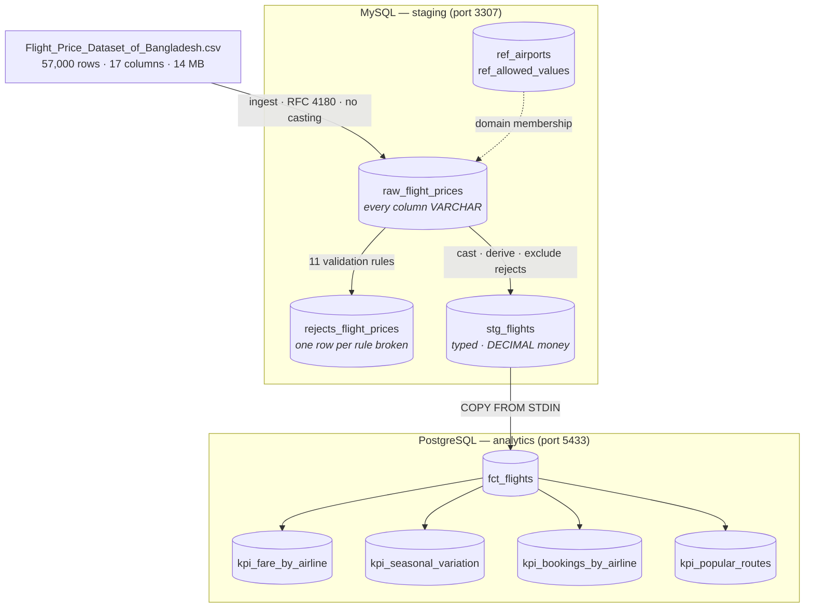

# Flight Price Analysis — Airflow Pipeline

An end-to-end orchestrated pipeline over the *Flight Price Dataset of Bangladesh*
(57,000 rows): CSV → MySQL staging → validation → PostgreSQL analytics → KPI marts.

Built with **Airflow 3.3.1** on **LocalExecutor**, entirely in Docker.

> 📄 **[Full project report → `docs/REPORT.md`](docs/REPORT.md)** — pipeline
> architecture and execution flow, per-task descriptions, KPI definitions with
> results, and the challenges encountered. That document is the project
> deliverable; this README is the operating manual.

---

## Quickstart

```bash
cp .env.example .env      # or: make init
make build                # build the extended Airflow image (once, ~3 min)
make up                   # start the stack
make ps                   # wait until services report healthy
```

Airflow UI → <http://localhost:8080> (default login `airflow` / `airflow`).

```bash
make logs S=airflow-scheduler   # tail one service
make mysql                      # shell into staging DB
make psql                       # shell into analytics DB
make test                       # run the test suite
make down                       # stop, keep data
make clean                      # stop and WIPE all data volumes
```

---

## Architecture



### Why three databases

| Service | Role | Host port |
|---|---|---|
| `airflow-meta` | Airflow's own bookkeeping — **never** pipeline data | *(internal only)* |
| `mysql-staging` | Raw landing + cleaned staging | **3307** |
| `postgres-analytics` | Fact table + KPI marts | **5433** |

Host ports are non-standard on purpose: this machine already runs a local MySQL
on 3306 and a local PostgreSQL on 5432. The containers never collide with them.

MySQL-for-staging + Postgres-for-analytics is not an architecture anyone would
choose for 57k rows — one database would do. It is a deliberate constraint of the
brief, and it does buy one real lesson: the cross-engine hop is where pipelines
actually break, so it is worth practising.

---

## Design decisions

**Land as TEXT, cast later.** A malformed value should never crash ingestion. It
should land successfully and then fail a validation *we wrote*, in a row we can
inspect. Ingest failures are opaque; validation failures are diagnostic.

**Quarantine, never drop.** Bad rows go to `rejects_flight_prices` with a reason
code. The DAG fails only when the reject rate exceeds `REJECT_RATE_THRESHOLD`.
Silently dropping rows is how a pipeline lies to people for six months.

**Every task is re-runnable.** Loads truncate-then-insert or delete-by-batch
first; KPI tables are rebuilt and swapped, never appended. Re-running a task must
leave identical row counts — if a bare `INSERT` ran twice, every booking count
would silently double.

**Transformation in SQL, orchestration in Python.** Aggregation is set-based work
the database is built for, the data never enters the worker's memory, and the
logic stays readable to anyone who knows SQL. Airflow moves control, not data —
XCom carries row counts and batch ids, never DataFrames.

**Connections declared as env vars.** `AIRFLOW_CONN_MYSQL_STAGING` and
`AIRFLOW_CONN_POSTGRES_ANALYTICS` are set in `docker-compose.yaml`, so a fresh
`docker compose up` needs zero clicking in the UI. The stack is reproducible
from source.

**No magic numbers, one config file.** Every tunable lives in
`include/config/pipeline.yml` with the reasoning beside it — thresholds, batch size,
the datetime guard regex, and the fare markup factor. Paths resolve from the
project root rather than a hardcoded `/opt/airflow`, so the same code runs in
the container, in CI, and in a bare checkout.

**Validity is data, not code.** Airport codes and the allowed categorical
values both live in reference tables seeded each run, so correcting a domain
is an `UPDATE` rather than a code change and a redeploy. The stopover-count
mapping rides along in the same table, because it is a property of the domain.

**Declared once, tested for drift.** The fact-table column contract lives in
`src/flight_pipeline/schema.py`; `tests/unit/test_schema_contract.py`
parses both DDL files and fails if they disagree — including column *order*,
since the transfer is a positional `COPY`.

---

## What the data actually contains

Profiled across all 57,000 rows before any code was written:

| Property | Value |
|---|---|
| Rows / columns | 57,000 × 17 |
| Date range | 2025-01-03 → 2026-03-31 |
| Nulls, duplicates, negative fares, self-routes | **0** |
| Airlines / sources / destinations / routes | 24 / 8 / 20 / 152 |
| Seasonality | `Regular` 44,525 · `Winter Holidays` 10,930 · `Hajj` 942 · `Eid` 603 |

### The one real anomaly

2,522 rows (**4.42%**) where `Base + Tax ≠ Total`. It is not noise:

```
discrepancy as % of total:  min 16.6667%  median 16.6667%  max 16.6667%
direction:                  2,522 over,  0 under
```

Identical to four decimals — a flat **20% markup**: `total = (base + tax) × 1.2`.
Deterministic, and spread evenly across class, stopovers and booking source.

Whether this is dirty data or an unstated surge-pricing rule cannot be settled
from the data alone. So the pipeline does not silently pick: it keeps
`total_fare_reported`, derives `total_fare_computed`, and flags the row with
`has_fare_markup` / `markup_pct`. KPIs use the reported total — that is what the
passenger paid — and the flag rate is published as a quality metric.

This is also why `REJECT_RATE_THRESHOLD` is 5% and not the 2% that intuition
suggests. Thresholds come from profiling, not from guesswork.

### Ingest hazards found during profiling

- **Airport names contain commas** — `"Netaji Subhas Chandra Bose International
  Airport, Kolkata"`. Naive comma-splitting yields 17, 18 *or* 19 fields per row.
  Requires an RFC 4180 reader; `LOAD DATA INFILE` needs explicit
  `FIELDS OPTIONALLY ENCLOSED BY '"'`.
- **Column names are hostile to SQL** — `Tax & Surcharge (BDT)`,
  `Departure Date & Time`. Normalised to snake_case at the landing boundary.
- **Money is stored as 15-decimal floats** — cast to `DECIMAL(12,2)`. Floats for
  currency is a correctness bug, not a style preference.
- **The brief's column names don't match the file** — it says `Base Fare`, the
  file says `Base Fare (BDT)`.

### The data is too clean to test the error handling

Zero nulls, zero negatives, zero duplicates means every validation check passes
on the real file and the quarantine path never executes — untested code that
merely *looks* like protection.

`include/data/fixtures/corrupted_sample.csv` therefore ships 27 rows: 14 pristine,
12 carrying one deliberate defect each (null FK, negative fare, non-numeric in a
numeric column, arithmetic violation, arrival-before-departure, self-route,
missing measure, negative lead time, unparseable date, unknown category, invalid
city), and 1 exact duplicate. Running the DAG against it proves the rejects table
fills and the threshold trips.

### Validating "invalid city names"

Validity of an airport code is membership in a set, not a pattern — `XXX` is
perfectly well-formed and not an airport. That set is **data**, so it lives in
`ref_airports` (20 airports, 8 of which serve as origins), seeded each run from
the tracked `include/data/reference/ref_airports.csv`. Correcting it is an
`UPDATE`, not a code change and a deploy.

It lives under `reference/` rather than `fixtures/` deliberately: every
production run reads it, so filing it as test material would misrepresent what
it is. The three subdirectories of `include/data/` each mean something
different — bulk source (untracked), curated lookup data (tracked), and test
input (tracked).

---

## Results

Full run over the real dataset, 14 tasks, ~14 seconds wall clock:

```
ingested            57,000        rejected              0
fct_flights         57,000        KPI bookings sum      57,000   (reconciled)
markup rows          2,522        = 4.42%                        (matches profiling)
```

**Seasonal fare variation** — the headline finding:

| Seasonality | Peak | Bookings | Avg fare (BDT) | vs Regular |
|---|---|---:|---:|---:|
| Hajj | ✓ | 942 | 97,144.47 | **+42.7%** |
| Eid | ✓ | 603 | 91,560.02 | **+34.5%** |
| Winter Holidays | ✓ | 10,930 | 79,676.74 | **+17.0%** |
| Regular | — | 44,525 | 68,077.27 | baseline |

**Top routes** are dominated by long-haul international (RJH→SIN 417 bookings
at ~114k BDT); the one domestic pair in the top 8, CGP→CXB, averages 7,673 BDT
— roughly a fifteenth of the international mean, which is the sanity check that
the fare pipeline preserved magnitudes correctly.

### What the corrupted fixture caught

Both of these would have passed silently against the real data forever, because
the real data never exercises them:

1. **`STR_TO_DATE` does not return `NULL` for junk.** Under MySQL 8's default
   strict `sql_mode` it raises error 1411 and aborts the statement — so the
   naive `STR_TO_DATE(col, fmt) IS NULL` test for a bad date *dies on a bad
   date*. Every call site now guards its input with a format regex, and the
   guard travels with the call rather than relying on a WHERE clause running
   first (SQL makes no such promise).
2. **No referential check on airports existed at all**, despite the brief
   asking for it. `ref_airports` and the `UNKNOWN_AIRPORT` rule came out of
   that gap.

A third bug surfaced on the first live run: `psycopg2.extras.execute_values`
imports fine because psycopg2 is a transitive dependency, but the Postgres
provider 7.x hands back a **psycopg 3** connection, so it fails at runtime.
The transfer now uses psycopg3's `COPY … FROM STDIN`, which is the correct
bulk path regardless.

---

## Tests

```bash
make test      # 36 tests
```

The suite is split by what it needs. `tests/unit/` (27 tests) imports no
Airflow at all — it runs on a bare Python install in about 0.03 seconds, which
is what lets CI check lint and logic without building a 3 GB image.
`tests/dag/` (9 tests) needs Airflow importable to build a DagBag.

`test_dag_integrity.py` asserts structure, not behaviour: the KPI tasks have no
dependency on each other, the reject gate really does sit *between* quarantine
and the staging build, every task has retries, and the DAG's only leaf is
`assert_kpis_populated` — a pipeline that ends on a write can go green having
written nothing.

`test_column_mapping.py` guards the source contract against schema drift, and
includes a test that the fixture still contains defects — if someone
regenerates it from clean data, every quarantine rule would pass against it and
the error handling would be untested again.

---

## Layout

```
pyproject.toml    package metadata, ruff + pytest config
config/           Airflow's own airflow.cfg — we do not squat here
dags/
  flight_price_pipeline.py   wiring only; no implementation, no magic numbers
src/flight_pipeline/
  config.py       typed access to pipeline.yml, paths resolved from the root
  schema.py       the column contracts, declared once
  ingest.py       CSV load + reference seeding
  transfer.py     MySQL -> PostgreSQL COPY
  checks.py       the gates (pure decision logic + thin DB wrappers)
include/
  data/raw/       bulk source extracts — gitignored
  data/reference/ curated lookup data — tracked, read by every run
  data/fixtures/  deliberately broken input — tracked, test material only
  sql/mysql/     staging DDL + transformations
  sql/postgres/  analytics DDL + KPI queries
tests/
  unit/          pure Python — no Airflow, no databases, runs in ~0.03s
  dag/           needs Airflow importable (DAG structure assertions)
scripts/
  integration_test.sh   end-to-end run + assertions; CI calls this same file
docs/            project report
.github/         CI: lint+unit · DAG structure · end-to-end integration
```

---

## Troubleshooting

**Port already allocated** — you have a local MySQL/PostgreSQL on 3306/5432.
Change `MYSQL_HOST_PORT` / `POSTGRES_HOST_PORT` in `.env`.

**Root-owned files in `logs/`** — `AIRFLOW_UID` in `.env` must equal `id -u`.

**DAG not appearing** — `make dag-test` shows import errors the UI hides.

**Config change ignored** — anything under `x-airflow-common` needs a full
`make restart`, not just a scheduler restart.
