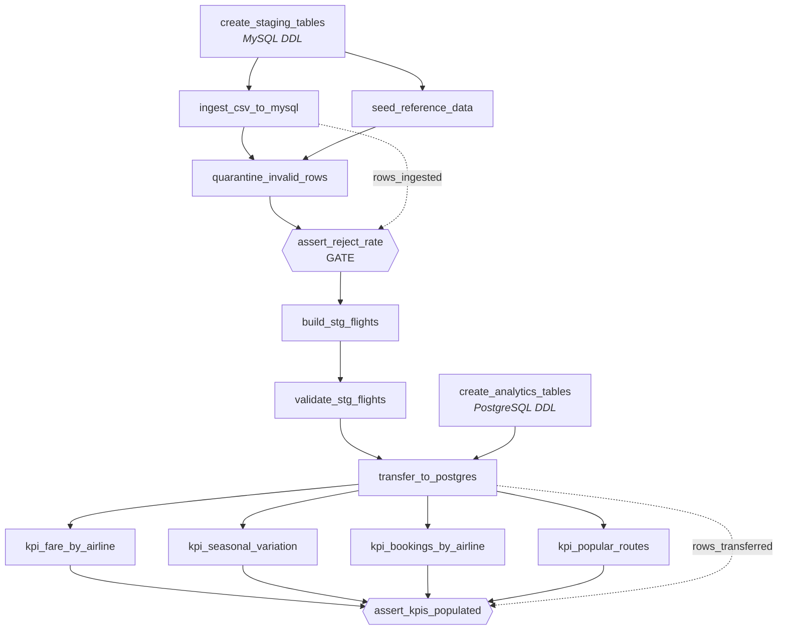

# Flight Price Analysis — Project Report

**Author:** Joseph Forson
**Repository:** `github.com/josephforson285/airflow-flight-price-analysis`
**Dataset:** Flight Price Dataset of Bangladesh (Kaggle) — 57,000 rows × 17 columns, 14 MB

---

## Contents

1. [Pipeline architecture and execution flow](#1-pipeline-architecture-and-execution-flow)
2. [DAG and task descriptions](#2-dag-and-task-descriptions)
3. [KPI definitions and computation logic](#3-kpi-definitions-and-computation-logic)
4. [Challenges encountered and how they were resolved](#4-challenges-encountered-and-how-they-were-resolved)
5. [Deviations from the brief](#5-deviations-from-the-brief)
6. [Verification evidence](#6-verification-evidence)

---

## 1. Pipeline architecture and execution flow

### 1.1 Layer design

The pipeline moves data through four named layers. Each layer has one job, and
the boundary between them is where a specific class of failure is caught.

```
   Flight_Price_Dataset_of_Bangladesh.csv        57,000 rows · 17 cols · 14 MB
                    │
                    │  ① INGEST — RFC 4180 reader, no casting
                    ▼
   MySQL   raw_flight_prices                     landing zone, every column VARCHAR
                    │
                    │  ② VALIDATE — 12 rules
                    ├──────────────────────────► rejects_flight_prices
                    │                            one row per (source row, rule broken)
                    │  ③ CAST + DERIVE
                    ▼
   MySQL   stg_flights                           typed, DECIMAL money, derived flags
                    │
                    │  ④ TRANSFER — COPY FROM STDIN
                    ▼
   Postgres  fct_flights                         analytics fact table
                    │
                    │  ⑤ AGGREGATE — four independent marts
                    ▼
   Postgres  kpi_fare_by_airline    kpi_seasonal_variation
             kpi_bookings_by_airline kpi_popular_routes
```

### 1.2 The three databases

| Service | Role | Host port |
|---|---|---|
| `airflow-meta` | Airflow's own bookkeeping. Never holds pipeline data. | *internal only* |
| `mysql-staging` | Raw landing zone + cleaned staging | **3307** |
| `postgres-analytics` | Fact table + KPI marts | **5433** |

Host ports are deliberately non-standard because the development machine
already runs a local MySQL on 3306 and a local PostgreSQL on 5432. The
containers therefore never collide with existing services.

Using two different database engines for 57,000 rows is not an architecture
anyone would choose — one database would serve. It is a constraint of the
brief, and it buys one genuine lesson: the cross-engine hop is where real
pipelines break, so it is worth practising deliberately.

### 1.3 Execution flow



The two DDL branches build in parallel; the four KPI marts fan out; the gate
sits directly between validation and the staging build; and the graph
terminates on an assertion rather than a write.

The two dotted edges are **XCom data dependencies**, created by passing a
task's return value as an argument. They carry a single integer each — the
ingested row count into the reject gate, the transferred count into the final
assertion — which is exactly what XCom is for. Airflow treats them as real
dependencies, so they appear in the UI graph too.

<details>
<summary><strong>Screenshot — the actual Airflow Graph view</strong> (click to
expand; click the image itself to open it full-resolution)</summary>

| |
|---|
| [](figures/airflow-graph-view.png) |

Captured from a real run. All 14 task ids match the DAG code exactly, so this
is evidence the graph above is what actually executes, not an aspirational
diagram. Wrapping it in a one-cell table is what gives it GitHub's native
horizontal scrollbar if the image is wider than the page — a plain ``
would just be silently scaled down instead, since GitHub strips inline
`style=` attributes that would otherwise force that behavior directly.

</details>

Three properties of this graph are deliberate:

**The two DDL branches are independent.** The analytics schema has no
dependency on any staging work, so it builds in parallel and converges only at
the transfer. Making it sequential would add wall-clock time for no reason.

**The reject gate sits between validation and the build.** It is a task in its
own right rather than a branch inside another task, so the UI shows precisely
which gate failed, and the threshold can be adjusted and that single task
re-run without re-ingesting 57,000 rows.

**The four KPI tasks fan out.** Nothing links them — they aggregate the same
fact table independently. A dependency between them would serialise work and
would signal that someone mistook "runs after" for "needs the result of".

### 1.4 Design principles

**Airflow orchestrates; the databases process.** XCom carries row counts and
batch identifiers only. XCom is backed by Airflow's own metadata database, so
pushing a 57,000-row payload through it would turn the orchestrator's
bookkeeping store into a data warehouse.

**Land as text, cast later.** Every column in `raw_flight_prices` is VARCHAR.
A malformed value must be able to land, so that it fails a validation we wrote
— on a row we can inspect — rather than aborting the load with a driver error
that names no row. Ingest failures are opaque; validation failures are
diagnostic.

**Quarantine, never drop.** Rejected rows go to `rejects_flight_prices` with a
reason code and a JSON payload of the original values. The run fails only if
the reject rate exceeds a configured threshold. Silently dropping rows is how
a pipeline misleads people for six months.

**Every task is re-runnable.** All loads are full-refresh (delete-then-load),
so clearing and re-running any task leaves identical row counts. A bare
`INSERT` re-run would silently double every booking count.

**Transformation in SQL, orchestration in Python.** Aggregation is set-based
work the database is built for; the data never enters the worker's memory, and
the logic stays readable to anyone who knows SQL.

### 1.5 Code organisation

The DAG file is wiring: it declares what runs, in what order, against which
connection. The work lives in `src/flight_pipeline/`, which imports no
Airflow — database access arrives as a `connect` callable supplied by the DAG.
That inversion is what makes the logic testable without a scheduler, a
metadata database or a 3 GB image, and it is why the unit suite runs in
hundredths of a second.

| Concern | Lives in |
|---|---|
| Tunables — thresholds, batch size, plausibility bounds, guard regex | `include/config/pipeline.yml` |
| Typed config access, path resolution | `src/flight_pipeline/config.py` |
| Column contracts | `src/flight_pipeline/schema.py` |
| CSV load, reference seeding | `src/flight_pipeline/ingest.py` |
| Cross-engine transfer | `src/flight_pipeline/transfer.py` |
| Gate decisions | `src/flight_pipeline/checks.py` |
| Connection type, transaction/rollback handling | `src/flight_pipeline/db.py` |
| Orchestration only | `dags/flight_price_pipeline.py` |

Three principles drove the split, each fixing a defect the first version had:

**No magic numbers.** The fare plausibility bound — the most consequential
rule here — was a bare `1.2` in two SQL files, while the trivial rounding
tolerance was already a proper parameter. Both now sit in `pipeline.yml` with
their reasoning written beside them.

**Declared once.** The fact-table column contract previously existed in three
places: two DDL files and a Python list. It is now declared once, and
`test_schema_contract.py` parses the DDL and fails if it drifts — including
column *order*, since the transfer is a positional `COPY`. That guard was
verified to actually fail before being trusted.

**Validity is data.** Airport codes were already a reference table on the
argument that a correction should be an `UPDATE` rather than a redeploy. Three
other domains contradicted that by sitting in SQL as string literals. They are
all reference data now.

---

## 2. DAG and task descriptions

**DAG id:** `flight_price_pipeline`
**Schedule:** `None` — the source is a static extract, so runs are triggered on demand
**`max_active_runs`:** 1 — the tables are full-refresh, so concurrent runs would corrupt each other
**Retries:** 2 per task with exponential backoff, so a transient database blip does not fail a run

### 2.1 Runtime parameters

| Parameter | Default | Purpose |
|---|---|---|
| `source_csv_path` | the real dataset | Lets the same DAG run against the corrupted test fixture with no code change |
| `fare_tolerance` | `0.01` | BDT tolerance for fare arithmetic comparisons |
| `reject_rate_threshold` | `0.05` | Fraction of rows allowed to fail validation before the run fails |

### 2.2 Task inventory

| # | Task | Type | Target | What it does |
|---|---|---|---|---|
| 1 | `create_staging_tables` | `SQLExecuteQueryOperator` | MySQL | Creates `ref_airports`, `raw_flight_prices`, `rejects_flight_prices`, `stg_flights`. Idempotent (`CREATE TABLE IF NOT EXISTS`). |
| 2 | `create_analytics_tables` | `SQLExecuteQueryOperator` | PostgreSQL | Creates `fct_flights`, its indexes, and the four KPI tables. Runs in parallel with task 1. |
| 3 | `ingest_csv_to_mysql` | TaskFlow `@task` | MySQL | Reads the CSV with `csv.DictReader`, verifies required columns exist and that every column has a mapping, then batch-inserts 5,000 rows at a time into the landing table. Returns the row count. |
| 4 | `seed_reference_data` | TaskFlow `@task` | MySQL | Loads the 20 known airports into `ref_airports`. Independent of task 3. |
| 5 | `quarantine_invalid_rows` | `SQLExecuteQueryOperator` | MySQL | Applies 11 validation rules, writing one row per violation into `rejects_flight_prices`. Marks only — deletes nothing. |
| 6 | `assert_reject_rate` | TaskFlow `@task` | MySQL | Computes distinct rejected rows ÷ ingested rows, logs the breakdown by reason, and raises if the rate exceeds the threshold or if nothing was ingested. **This is the gate.** |
| 7 | `build_stg_flights` | `SQLExecuteQueryOperator` | MySQL | Casts, trims, rounds money to `DECIMAL(12,2)`, derives `stopover_count`, `is_peak_season` and the fare-markup columns. Anti-joins the rejects table so quarantined rows are excluded. |
| 8 | `validate_stg_flights` | `SQLColumnCheckOperator` | MySQL | Declarative post-conditions on the *typed* table: no negative fares, positive totals, non-negative lead time, `stopover_count` within 0–2. |
| 9 | `transfer_to_postgres` | TaskFlow `@task` | MySQL → PostgreSQL | Streams staging rows in 5,000-row chunks into `fct_flights` using PostgreSQL `COPY … FROM STDIN`. Neither side holds the full dataset in memory. |
| 10 | `kpi_fare_by_airline` | `SQLExecuteQueryOperator` | PostgreSQL | Builds KPI 1 |
| 11 | `kpi_seasonal_variation` | `SQLExecuteQueryOperator` | PostgreSQL | Builds KPI 2 |
| 12 | `kpi_bookings_by_airline` | `SQLExecuteQueryOperator` | PostgreSQL | Builds KPI 3 |
| 13 | `kpi_popular_routes` | `SQLExecuteQueryOperator` | PostgreSQL | Builds KPI 4 |
| 14 | `assert_kpis_populated` | TaskFlow `@task` | PostgreSQL | Confirms no table is empty, that `fct_flights` matches the transferred count, and that KPI bookings **reconcile** to the fact table. |

Task 14 exists because a pipeline whose final step is a write can report
success having written nothing. It is the task that makes "green" mean
something, and it is the DAG's only leaf.

### 2.3 Validation rules applied by task 5

| Reason code | Detects |
|---|---|
| `MISSING_REQUIRED` | Any required field null or blank |
| `NON_NUMERIC_FARE` | Fare column that is not a number (`"N/A"`, empty, text) |
| `NEGATIVE_FARE` | Numeric but below zero |
| `UNPARSEABLE_DATE` | Timestamp not matching `YYYY-MM-DD HH:MM:SS` |
| `ARRIVAL_BEFORE_DEPARTURE` | Arrival at or before departure |
| `SELF_ROUTE` | Source equals destination |
| `UNKNOWN_CATEGORY` | Class, stopovers or seasonality outside the profiled domain |
| `NEGATIVE_LEAD_TIME` | Negative `days_before_departure` |
| `UNKNOWN_AIRPORT` | Airport code absent from `ref_airports` — the brief's "invalid city names" |
| `DUPLICATE_ROW` | Exact duplicate across **all 17** source columns; first occurrence kept |
| `NON_NUMERIC_MEASURE` | `duration_hrs` or `days_before_departure` not a number |
| `IMPLAUSIBLE_DURATION` | Duration ≤ 0 or beyond the configured bound (48 h) |

`MISSING_REQUIRED` covers **every** column declared `NOT NULL` in
`stg_flights`, not only the six the brief names. An earlier version checked
seven; a blank `aircraft_type` or `booking_source` therefore passed quarantine
and then failed the staging `INSERT` on a constraint error naming no row —
precisely the opaque failure the landing zone exists to prevent.

A row breaking several rules produces several reject records. Recording only
the first violation would hide the rest from whoever has to fix the source.

---

## 3. KPI definitions and computation logic

All four KPIs are computed from `fct_flights` in PostgreSQL, using
`total_fare_reported_bdt` — the fare as supplied, which is what the passenger
actually paid — rather than the recomputed `base + tax`. Section 4.4 explains
why that distinction exists.

### KPI 1 — Average Fare by Airline

**Definition.** Mean total fare per airline, with dispersion and a data-quality
counter.

```
avg_total_fare_bdt = AVG(total_fare_reported_bdt)  GROUP BY airline
discrepancy_row_count   = COUNT(*) FILTER (WHERE has_fare_discrepancy)
```

`min`, `max`, mean base fare and mean tax are carried alongside. Source:
[`10_kpi_fare_by_airline.sql`](../include/sql/postgres/10_kpi_fare_by_airline.sql).

**Result — 24 airlines. Selected rows:**

| Airline | Bookings | Avg fare (BDT) | Markup rows |
|---|---:|---:|---:|
| Turkish Airlines | 2,220 | 75,547.27 | 104 |
| AirAsia | 2,312 | 74,534.39 | 101 |
| Cathay Pacific | 2,282 | 73,325.09 | 105 |
| … | | | |
| Singapore Airlines | 2,279 | 68,323.93 | 114 |
| Vistara | 2,368 | 68,108.24 | 103 |

**Analytical caveat — this KPI is a weak discriminator in this dataset.** The
full range of airline mean fares is roughly 68,100 to 75,500 BDT, a spread of
about 11%. Given fares within the data span 1,800 to 558,987 BDT, airline
identity explains very little of the variation. `discrepancy_row_count` is likewise
near-uniform (91–114 per airline). Both point to fares having been generated
largely independently of airline. The KPI is computed as specified, but it
should not be read as evidence that one carrier is systematically pricier.

### KPI 2 — Seasonal Fare Variation

**Definition.** Mean fare per season, and each season's premium over the
`Regular` baseline.

```
avg_total_fare_bdt = AVG(total_fare_reported_bdt)  GROUP BY seasonality
vs_regular_pct     = 100 × (season_avg − regular_avg) / regular_avg
is_peak_season     = seasonality <> 'Regular'
```

The baseline is isolated in a CTE and cross-joined, with a divide-by-zero guard
so that an absent `Regular` cohort yields 0 rather than crashing mid-DAG.
Source: [`11_kpi_seasonal_variation.sql`](../include/sql/postgres/11_kpi_seasonal_variation.sql).

**Note on peak-season definition.** The brief anticipates building a holiday
calendar ("e.g. Eid, Winter holidays"). That proved unnecessary: the source
ships a `Seasonality` column with exactly four values, so peak is simply
everything that is not `Regular`. Had it been absent, a `dim_calendar` table
would have been required — Eid follows the lunar calendar and shifts about 11
days earlier each Gregorian year, so hard-coded dates would silently rot.

**Result — the strongest signal in the dataset:**

| Seasonality | Peak | Bookings | Avg fare (BDT) | vs Regular |
|---|:---:|---:|---:|---:|
| Hajj | ✓ | 942 | 97,144.47 | **+42.70%** |
| Eid | ✓ | 603 | 91,560.02 | **+34.49%** |
| Winter Holidays | ✓ | 10,930 | 79,676.74 | **+17.04%** |
| Regular | — | 44,525 | 68,077.27 | baseline |

Unlike KPI 1, this is a large and well-ordered effect: the two religious
pilgrimage/festival periods command the steepest premiums, and the ordering
(Hajj > Eid > Winter Holidays > Regular) is consistent with demand
concentrated into narrow, immovable travel windows.

### KPI 3 — Booking Count by Airline

**Definition.** Volume per airline, expressed as a share rather than a bare
count.

```
bookings       = COUNT(*)                          GROUP BY airline
share_pct      = 100 × COUNT(*) / total_bookings
routes_served  = COUNT(DISTINCT (source, destination))
total_fare_bdt = SUM(total_fare_reported_bdt)
```

**On the words "bookings" and "revenue".** The brief names this KPI "Booking
Count by Airline", so the column keeps that name — but the dataset does not
evidence a booking. All 57,000 rows are distinct
`(airline, source, destination, departure time)` combinations, **no flight
appears twice**, and there is no booking identifier, passenger count or seat
quantity; `booking_source` records a channel, not a transaction. Each row is
one priced flight record.

That distinction matters for the second measure. This column was originally
called `revenue_bdt`, which was wrong: revenue requires seats sold, and
summing advertised fares across unique flight records is not that. It is
renamed `total_fare_bdt` — the sum is still a useful exposure measure, as long
as it is not called something it isn't.

Source: [`12_kpi_bookings_by_airline.sql`](../include/sql/postgres/12_kpi_bookings_by_airline.sql).

**Result — 24 airlines, 57,000 bookings, 4.05 bn BDT total revenue:**

| Airline | Bookings | Share | Routes | Revenue (BDT) |
|---|---:|---:|---:|---:|
| US-Bangla Airlines | 4,496 | 7.89% | 152 | 324,108,947 |
| Vistara | 2,368 | 4.15% | 152 | 161,280,309 |
| Lufthansa | 2,368 | 4.15% | 152 | 164,086,212 |
| FlyDubai | 2,346 | 4.12% | 152 | 161,845,119 |
| Biman Bangladesh Airlines | 2,344 | 4.11% | 152 | 164,532,320 |
| Emirates | 2,327 | 4.08% | 152 | 163,137,010 |

US-Bangla, the Bangladeshi domestic carrier, holds roughly double the share of
any other airline — the one plausibly realistic feature of the distribution.
The remaining 23 sit within 4.08–4.15%, essentially uniform.

**Second analytical caveat.** `routes_served = 152` for **every** airline —
all 24 carriers serve all 152 routes, including e.g. European carriers on
purely domestic Bangladeshi hops. This is not commercially realistic and
confirms the dataset is synthetic with airline assigned independently of route.

### KPI 4 — Most Popular Routes

**Definition.** Every source→destination pair ranked by booking volume.

```
bookings           = COUNT(*)  GROUP BY source_code, destination_code
avg_total_fare_bdt = AVG(total_fare_reported_bdt)
airlines_serving   = COUNT(DISTINCT airline)
rank_position      = ROW_NUMBER() OVER (ORDER BY bookings DESC,
                                        source_code, destination_code)
```

Source: [`13_kpi_popular_routes.sql`](../include/sql/postgres/13_kpi_popular_routes.sql).

**Two deliberate choices.** All 152 routes are stored with their rank rather
than only a top-N slice — a pipeline that silently truncates to ten rows reads,
months later, as though the world contains ten routes. "Top 5" belongs in the
consumer's `WHERE rank_position <= 5`. Ties break on route code so that
re-running does not reshuffle equal-count routes and make the table appear to
have changed when nothing did.

**Result — top 8 of 152:**

| # | Route | Destination | Bookings | Avg fare (BDT) |
|---:|---|---|---:|---:|
| 1 | RJH→SIN | Singapore Changi | 417 | 113,962.52 |
| 2 | DAC→DXB | Dubai International | 413 | 104,942.47 |
| 3 | BZL→YYZ | Toronto Pearson | 410 | 107,844.15 |
| 4 | CGP→BKK | Suvarnabhumi, Bangkok | 408 | 107,170.36 |
| 5 | CXB→DEL | Indira Gandhi, Delhi | 408 | 100,160.85 |
| 6 | BZL→JED | King Abdulaziz, Jeddah | 407 | 112,749.32 |
| 7 | CGP→CXB | Cox's Bazar | 404 | **7,673.47** |
| 8 | RJH→JFK | John F. Kennedy | 404 | 114,415.73 |

Booking volumes are near-uniform (404–417), again reflecting synthetic
generation. The fares, however, are internally consistent: CGP→CXB is the one
domestic pair in the top eight and averages 7,673 BDT — roughly one-fifteenth
of the international mean. That the pipeline preserves this order-of-magnitude
distinction is a useful end-to-end sanity check on the money handling.

---

## 4. Challenges encountered and how they were resolved

### 4.1 The source data was too clean to test the error handling

**Problem.** Profiling all 57,000 rows before writing any code found **zero**
nulls, zero duplicates, zero negative fares, zero self-routes and zero
arrival-before-departure rows. Every validation rule the brief asks for would
pass against the real file, meaning the entire quarantine path would never
execute. That is untested code that merely *looks* like protection.

**Resolution.** A deliberately corrupted fixture,
`include/data/fixtures/corrupted_sample.csv`: 32 rows comprising 16 rows that
pass every rule, 15 each carrying one planted defect, and one exact duplicate. One of
the pristine rows is a deliberate near-duplicate — identical to another row
except for `aircraft_type` — which guards against the duplicate fingerprint
regressing to a partial one. The
same DAG runs against it by overriding `source_csv_path` at trigger time — no
code change. Two runs are performed: one at the strict 5% threshold to prove
the gate blocks, and one at a relaxed threshold to prove the downstream path
correctly processes only the clean rows.

The fixture immediately justified itself by exposing the next two bugs.

### 4.2 `STR_TO_DATE` aborts instead of returning NULL

**Problem.** The rule for detecting unparseable dates was written as
`STR_TO_DATE(col, fmt) IS NULL`. Under MySQL 8's default strict `sql_mode`,
`STR_TO_DATE` does not return NULL for unparseable input — it raises
**error 1411** and aborts the entire statement. The task failed with:

```
(1411, "Incorrect datetime value: 'not-a-timestamp' for function str_to_date")
```

The rule for detecting bad dates was itself unable to survive a bad date. It
would have passed against the real data indefinitely.

**Resolution.** Every `STR_TO_DATE` call now guards its input with a format
regex, so the function receives `NULL` — which it handles — rather than junk:

```sql
STR_TO_DATE(IF(col REGEXP '^[0-9]{4}-[0-9]{2}-[0-9]{2}[ T][0-9]{2}:[0-9]{2}:[0-9]{2}$',
               col, NULL), '%Y-%m-%d %H:%i:%s')
```

The guard is repeated at **every** call site, including in the staging build,
rather than relying on the anti-join to filter bad rows first. SQL makes no
guarantee that a `WHERE` predicate is evaluated before a projection, so
depending on that ordering would be a latent bug.

### 4.3 No referential check on airports existed at all

**Problem.** The relaxed fixture run caught 11 of 12 planted defects. The
escapee carried source code `XXX` and airport name "Nonexistent Airport,
Nowhere" — the brief's explicit "invalid city names" requirement had no
implementation. Validity of an airport code cannot be expressed as a pattern:
`XXX` is perfectly well-formed and is not an airport.

**Resolution.** Validity is *membership in a set*, and that set is data rather
than code. A `ref_airports` table was added, seeded each run from
`include/data/reference/ref_airports.csv` (20 airports, 8 of which serve as
origins), together with an `UNKNOWN_AIRPORT` rule that anti-joins against it.
Correcting the domain is now an `UPDATE`, not a code change and a redeploy.
With this in place every planted defect is caught.

### 4.4 A 20% fare markup on 4.42% of rows — data error or business rule?

**Problem.** 2,522 rows (4.42%) have `base + tax ≠ total`. The discrepancy is
not random:

```
as % of total:  min 16.6667%   median 16.6667%   max 16.6667%
direction:      2,522 over,    0 under
```

Identical to four decimal places across all 2,522 rows — a flat 20% markup,
`total = (base + tax) × 1.2`, spread evenly across class, stopovers and booking
source. This is deterministic, so it is not corruption in the ordinary sense.
It is either dirty data or an unstated surcharge rule, and the data alone
cannot settle which.

**Resolution.** The pipeline refuses to silently pick. Both values are kept —
`total_fare_reported_bdt` and `total_fare_computed_bdt` — alongside
`fare_variance_bdt`, a `has_fare_discrepancy` flag and `fare_variance_pct`. KPIs use the
reported total, because that is what the passenger paid, and the flag count is
published in KPI 1 so the caveat travels with the number instead of being
buried in a `COALESCE`.

Nothing is rejected for disagreeing. Detection is one expression —
`ABS(reported − computed) > tolerance` — and the size of the disagreement lands
in `fare_variance_pct`, so the 20% is **observed rather than assumed**: across
all 2,522 rows that column reads 20.000 with zero standard deviation. An
earlier version tested for the ×1.2 factor directly, which was a constant
fitted to this extract: a file with a different markup would have been
quarantined and, because 4.42% sits under the 5% gate, silently dropped.

In a production setting this is the point at which one asks the data owner.
Absent an owner, preserving the evidence and making the ambiguity visible is
the defensible action.

### 4.5 A validation threshold set by intuition was wrong

**Problem.** The reject-rate threshold was initially set to 2% on instinct. The
markup anomaly alone accounts for 4.42% of rows. Had those rows been rejected,
a 2% gate would have failed every single run from day one.

**Resolution.** The threshold was raised to 5% *and justified from the
profiling* rather than from a feeling, and the reasoning is recorded in
`.env.example` beside the value. The wider lesson, which applies to every
number in this pipeline, is that thresholds are derived from measurement.

### 4.6 The driver the provider actually returns is not the one you import

**Problem.** The cross-engine transfer was written with
`psycopg2.extras.execute_values`. It imported without complaint and failed at
runtime:

```
AttributeError: 'Connection' object has no attribute 'encoding'
```

`apache-airflow-providers-postgres` 7.x returns a **psycopg 3** connection,
while `psycopg2-binary` is present as a transitive dependency. So the import
succeeds, the code looks correct, and the mismatch only appears when a
psycopg2 helper is handed a psycopg3 connection.

**Resolution.** The driver was identified empirically rather than assumed
(`type(hook.get_conn())` → `psycopg.Connection`), and the transfer rewritten to
use psycopg3's `COPY … FROM STDIN`. This is the better implementation
regardless: `COPY` is PostgreSQL's bulk path and skips per-row statement
parsing and planning entirely.

### 4.7 The `.gitignore` silently defeated its own exception

**Problem.** The intent was to exclude bulk data but track the small test
fixture. The first attempt was:

```gitignore
include/data/
!include/data/fixtures/*.csv
```

The negation had no effect. Git does not descend into an excluded **directory**,
so no `!` rule inside one can ever re-include anything. The fixture would have
been silently absent from the repository.

**Resolution.** Exclude the *contents* and re-admit the tracked subdirectories,
in that order:

```gitignore
include/data/**
!include/data/reference/
!include/data/reference/**
!include/data/fixtures/
!include/data/fixtures/**
```

Verified with `git add --dry-run --all`, which is authoritative —
`git check-ignore` exits 0 when a path matches a *negation* rule too, so its
exit status alone is misleading here.

### 4.8 Environment conflicts on the development machine

**Problem.** Three collisions. Ports 3306 and 5432 were already held by a local
MySQL and PostgreSQL. The user account was not a member of the `docker` group,
so every Docker command failed with a socket permission error. And the host
Python is 3.14 with an active virtualenv whose `PYTHONPATH` injects Python 3.12
site-packages from an unrelated ROS 2 installation.

**Resolution.** Containers publish on **3307**, **5433** and **8080**, leaving
the local services untouched. The account was added to the `docker` group. The
entire stack — Airflow, both databases, the tests — runs in Docker, so the host
Python environment is never involved; even preliminary CSV profiling was run
with `env -u PYTHONPATH -u VIRTUAL_ENV` against the system interpreter.

### 4.9 Airflow 3 API differences from the documented majority

**Problem.** Most available material targets Airflow 2. Several differences
surfaced: the `webserver` component is now `api-server`, the `dag-processor` is
a separate service, `DagBag` moved to `airflow.dag_processing.dagbag` and no
longer accepts `include_examples`, and manually-triggered runs may carry no
`logical_date`, which makes date-range task clearing impractical.

**Resolution.** The Compose file was adapted from the *official* Airflow 3.3.1
file rather than written from memory, and each API was checked by inspecting
the installed signature (`inspect.signature(DagBag.__init__)`) before use.

### 4.10 The Total Fare requirement was already satisfied

**Problem.** The brief asks to compute `Total Fare = Base Fare + Tax &
Surcharge` "if not already present". It is present — and, per 4.4, disagrees
with `base + tax` on 4.42% of rows.

**Resolution.** The requirement was reinterpreted as a *validation* rather than
a transformation: the computed value is derived, compared against the supplied
one, and the disagreement recorded. This satisfies the intent of the
requirement while surfacing a genuine finding that a blind recomputation would
have destroyed.

### 4.11 `CREATE TABLE IF NOT EXISTS` cannot evolve a schema

**Problem.** Renaming `revenue_bdt` to `total_fare_bdt` in the analytics DDL
appeared to work — the DDL task went green — and then `kpi_bookings_by_airline`
failed on a column that "should" have existed. `IF NOT EXISTS` is a no-op
against an existing table: the file said one thing and the database kept
another, silently.

**First attempt, and why it was wrong.** The marts were changed to `DROP` then
`CREATE`. That fixed the drift but broke something else: the `DROP` ran in
`create_analytics_tables` at the *start* of the DAG, so a failing KPI task left
its mart **empty** until a successful re-run. Previously `DELETE` + `INSERT`
inside one transaction had rolled back and kept the previous data. One safety
was traded for another.

**Resolution.** Each mart now builds into `kpi_x__new` and replaces the live
table inside a **single transaction**. PostgreSQL has transactional DDL, so all
three properties hold at once: the schema comes from the file every run so it
cannot drift; readers see the previous mart until commit, so there is no empty
window; and a failure anywhere rolls the whole rebuild back.

Verified by running the swap statements and forcing a division by zero
mid-transaction:

```
rows_before   10        rows_after    10     ← previous mart survived
leftover      0                              ← no __new debris
schema        all 9 original columns intact
```

Both the `DROP` and the `RENAME` rolled back.

`fct_flights` keeps `IF NOT EXISTS` — it is a load target, not a derivative —
so it gets an explicit guard instead. `transfer_to_postgres` compares the live
columns against the declared contract *before* deleting anything and fails with
the exact difference, rather than surfacing later as a `COPY` error on an
unknown column. Five unit tests cover it, including the column-**order** case:
the transfer is a positional `COPY`, so the right names in the wrong order
would load every value into the wrong column without erroring at all.

### 4.12 Database code had no failure path

**Problem.** Every database function opened a connection, worked, committed and
closed. If anything raised in between, the commit never ran, the rollback never
ran, and the connection was never closed — it leaked until garbage collection
while holding server-side locks and a connection slot. A load that failed
halfway left an open transaction for the server to time out.

**Resolution.** A `transaction()` context manager in
`src/flight_pipeline/db.py`: commit on success, rollback on any exception,
close on every path. It catches `BaseException` rather than `Exception`, so a
task killed by SIGTERM — Airflow marking it `up_for_retry`, a pod eviction —
also rolls back instead of leaving a half-applied batch. Being a context
manager, it cannot be forgotten at a new call site the way a stray
`conn.close()` can.

The two writes that span multiple statements are now genuinely atomic: the
reference seed loads both tables or neither (seeding airports but failing on
allowed values would leave `UNKNOWN_AIRPORT` armed and `UNKNOWN_CATEGORY`
silently passing everything), and the transfer's `DELETE` plus `COPY` share one
transaction, so a failed transfer leaves the previous good fact table intact
rather than an empty one.

### 4.13 The data does not evidence "bookings" or "revenue"

**Problem.** Both words were being used as though the dataset supported them.
It does not: all 57,000 rows are distinct
`(airline, source, destination, departure time)` combinations, **no flight
appears twice**, and there is no booking identifier, passenger count or seat
quantity. Each row is one priced flight record.

**Resolution.** `bookings` is retained because it is the brief's own term for
the KPI, with the assumption stated in the report and beside the SQL.
`revenue_bdt` — which was this project's invention, not the brief's — is
renamed `total_fare_bdt`, because revenue requires seats sold and a sum of
advertised fares over unique flight records is not that. The measure is still
published; it is simply no longer called something it isn't.

### 4.14 A rule that did not do what its name said

**Problem.** The `DUPLICATE_ROW` rule was labelled "exact duplicate rows" and
reported `occurrence #N of an identical row`, but its fingerprint covered only
**12 of the 17** source columns — omitting `source_name`, `destination_name`,
`duration_hrs`, `stopovers` and `aircraft_type`. Two rows differing only in,
say, aircraft type therefore hashed identically, and the second was quarantined
as an "identical row" it was not. It was testing a partial business key while
claiming to test row equality.

A second defect sat alongside it: the fingerprint used `CONCAT_WS('')` — an
**empty** separator — which makes the hash ambiguous. Airline `US` with source
`BD` concatenates to the same string as airline `USB` with source `D`, so
genuinely different rows could collide and one would be wrongly rejected.

**Resolution.** The fingerprint now covers all 17 source columns, separated by
`CHAR(31)` (the ASCII unit separator) with `CHAR(30)` standing in for NULL, so
neither the field boundaries nor the null marker can be forged by ordinary
data. The rule now means what its name says.

A regression guard was added to the fixture: a row identical to another except
for `aircraft_type`. Under the old fingerprint it would be wrongly flagged as a
duplicate; the integration test now asserts it is **promoted** to staging
(16 clean rows rather than 15), so the fingerprint cannot silently narrow again.

Worth recording honestly: this gap was noticed earlier, while adding fixture
rows, and worked around by giving those rows distinct timestamps instead of
being fixed. Working around a known defect is how it survives to be found by
someone else.

---

## 5. Deviations from the brief

Stated plainly, with reasoning, rather than left for a reader to discover.

| Deviation | Reason |
|---|---|
| **Two staging tables, not one.** The brief implies a single MySQL staging table with "column types matching the original structure". The pipeline uses an untyped landing table (`raw_flight_prices`) followed by a typed one (`stg_flights`). | The typed table satisfies the requirement. The untyped landing zone is what allows a malformed value to fail an inspectable validation rather than abort the load. |
| **Total Fare treated as a validation, not a transformation.** | The column already exists; see 4.10. |
| **Docker used throughout**, which the brief does not mention. | Reproducibility, and it avoids the host environment conflicts in 4.8. |
| **Additions beyond scope:** reference-data table, corrupted fixture, 16 automated tests, reject quarantine with reason codes. | Each supports a stated requirement — `UNKNOWN_AIRPORT` implements "invalid city names"; the fixture is the only way the error handling is ever exercised; quarantine is "flag or correct" done explicitly. |

An earlier iteration also added dbt and Cosmos. These were **reverted**: the
brief lists exactly five technologies and dbt is not among them. That work
remains in the history at commit `d0f50ad` for future reference.

---

## 6. Verification evidence

### 6.1 Full run — real dataset

All 14 tasks succeeded; approximately 14 seconds wall clock.

```
ref_airports seeded        20
rows ingested          57,000
rows rejected               0
rows staged            57,000
fct_flights            57,000
KPI bookings sum       57,000     ← reconciles against the fact table
routes ranked             152
markup rows flagged     2,522     = 4.42%, matching independent profiling
```

### 6.2 Fixture run — strict threshold (gate must block)

```
ingested                   32
distinct rows rejected     16     = 50.0% > 5% threshold
outcome                    assert_reject_rate FAILED, pipeline halted
                           before publishing anything
```

Reject breakdown across all 12 rules: `MISSING_REQUIRED` 4,
`NON_NUMERIC_FARE` 2, `NON_NUMERIC_MEASURE` 2, and one each of
`ARRIVAL_BEFORE_DEPARTURE`, `DUPLICATE_ROW`, `IMPLAUSIBLE_DURATION`,
`NEGATIVE_FARE`, `NEGATIVE_LEAD_TIME`, `SELF_ROUTE`, `UNKNOWN_AIRPORT`,
`UNKNOWN_CATEGORY`, `UNPARSEABLE_DATE`.

### 6.3 Fixture run — relaxed threshold (downstream must exclude rejects)

```
ingested                   32
rejected                   16
fct_flights                16     ← exactly the clean rows
all four KPI tables        populated, pipeline green
```

The four KPI tasks began within 4 milliseconds of one another, confirming
genuine parallel execution rather than incidental ordering.

### 6.4 Automated tests

```
36 passed        27 unit (no Airflow) + 9 DAG structure
```

The unit suite runs in a plain `python:3.13-slim` container with Airflow not
installed at all, completing in 0.03 seconds. That is what allows CI to check
lint and logic on every push without building the image.

`test_dag_integrity.py` asserts structure rather than behaviour: no KPI task
depends on another, the reject gate genuinely sits between quarantine and the
staging build, every task has retries configured, and `assert_kpis_populated`
is the DAG's only leaf.

`test_column_mapping.py` guards the source-column contract against schema
drift, and includes a test that the fixture still *contains* defects — if it
were ever regenerated from clean data, every quarantine rule would pass against
it and the error handling would quietly become untested again.

### 6.5 Reproducing

```bash
cp .env.example .env
make build && make up
make test
# then trigger flight_price_pipeline from http://localhost:8080
```
