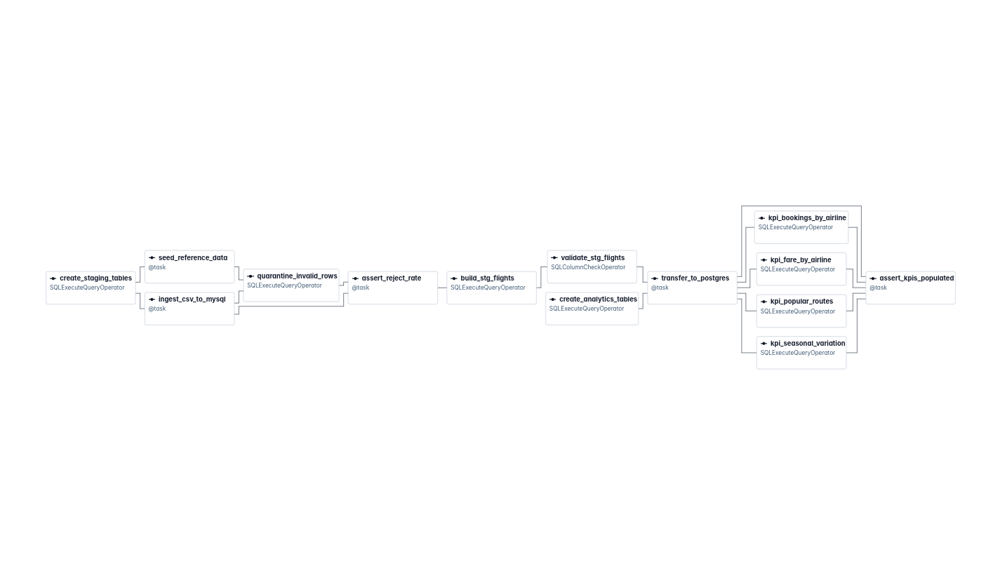

# Flight Price Analysis — Project Report

**Author:** Joseph Forson

**Dataset:** Flight Price Dataset of Bangladesh (Kaggle) — 57,000 rows × 17 columns, 14 MB

---

## Contents

1. [Pipeline architecture and execution flow](#1-pipeline-architecture-and-execution-flow)
2. [DAG and task descriptions](#2-dag-and-task-descriptions)
3. [KPI definitions and computation logic](#3-kpi-definitions-and-computation-logic)
4. [Challenges encountered and how they were resolved](#4-challenges-encountered-and-how-they-were-resolved)


---

## 1. Pipeline architecture and execution flow

### 1.1 Layer design

The pipeline moves data through four named layers with Airflow coordinating them. Each layer has one job.

```
   Flight_Price_Dataset_of_Bangladesh.csv     
                    │
                    │  ① INGEST
                    ▼
   MySQL   raw_flight_prices                     landing zone 
                    │
                    │  ② VALIDATE — 12 rules
                    ├──────────────────────────► rejects_flight_prices
                    │                            
                    │  ③ CAST + DERIVE
                    ▼
   MySQL   stg_flights                           
                    │
                    │  ④ TRANSFER 
                    ▼
   Postgres  fct_flights                         analytics fact table
                    │
                    │  ⑤ AGGREGATE — four independent marts
                    ▼
   Postgres  kpi_fare_by_airline    kpi_seasonal_variation
             kpi_bookings_by_airline kpi_popular_routes
```

### 1.2 The  databases

| Service              | Role                               |
| -------------------- | ---------------------------------- |
| `mysql-staging`      | Raw landing zone + cleaned staging |
| `postgres-analytics` | Fact table + KPI marts             |


The two databases give a clear picture of how we utilise the airflow orchestration tool to coordinate data.

### 1.3 Execution flow

The Airflow Graph view of a real run (Tap on the figure for full view).

| |
|---|
| [](figures/airflow-graph-view.png) |

The two DDL branches build in parallel, the four KPI marts fan out, the gate
sits directly between validation and the staging build and the graph
terminates on an assertion.

Two of the edges are **XCom data dependencies**, created by passing a task's
return value as an argument. Airflow treats them as real dependencies, so they shape the graph above
just like the declared ones.

Three properties of this graph are deliberate:

**The two DDL branches are independent.** 

**The reject gate sits between validation and the build.**  

**The four KPI tasks fan out.** 

### 1.4 Design principles

**Airflow orchestrates; the databases process.** 

**Land as text, cast later.** 

**Quarantine, never drop.**  

**Every task is re-runnable.**  

**Transformation in SQL, orchestration in Airflow Python.**  

### 1.5 Code organisation

The DAG file is wiring: it declares what runs, in what order, against which
connection. The work lives in `src/flight_pipeline/`. 

| Concern | Lives in |
|---|---|
| Tunables — thresholds, batch size, plausibility bounds, guard regex | `include/config/pipeline.yml` |
| Typed config access, path resolution | `src/flight_pipeline/config.py` |
| Column contracts | `src/flight_pipeline/schema.py` |
| CSV load, reference seeding | `src/flight_pipeline/ingest.py` |
| Cross-engine transfer | `src/flight_pipeline/transfer.py` |
| Gate decisions | `src/flight_pipeline/checks.py` |
| Connection type, transaction/rollback handling | `src/flight_pipeline/db.py` |
| Orchestration only | `dags/flight_price_pipeline.py` |

 
---

## 2. DAG and task descriptions

**DAG id:** `flight_price_pipeline`

**Schedule:** `None` 

**`max_active_runs`:** 1 

**Retries:** 2 per task with exponential backoff

### 2.1 Runtime parameters

| Parameter | Default | Purpose |
|---|---|---|
| `source_csv_path` | the real dataset | Lets the same DAG run against the corrupted test fixture with no code change |
| `fare_tolerance` | `0.01` | BDT tolerance for fare arithmetic comparisons |
| `reject_rate_threshold` | `0.05` | Fraction of rows allowed to fail validation before the run fails |

### 2.2 Task inventory

| # | Task | Type | Target | What it does |
|---|---|---|---|---|
| 1 | `create_staging_tables` | `SQLExecuteQueryOperator` | MySQL | Creates `ref_airports`, `raw_flight_prices`, `rejects_flight_prices`, `stg_flights`. Idempotent (`CREATE TABLE IF NOT EXISTS`). |
| 2 | `create_analytics_tables` | `SQLExecuteQueryOperator` | PostgreSQL | Creates `fct_flights`, its indexes, and the four KPI tables. Runs in parallel with task 1. |
| 3 | `ingest_csv_to_mysql` | TaskFlow `@task` | MySQL | Reads the CSV with `csv.DictReader`, verifies required columns exist and that every column has a mapping, then batch-inserts 5,000 rows at a time into the landing table. Returns the row count. |
| 4 | `seed_reference_data` | TaskFlow `@task` | MySQL | Loads the 20 known airports into `ref_airports`. Independent of task 3. |
| 5 | `quarantine_invalid_rows` | `SQLExecuteQueryOperator` | MySQL | Applies 11 validation rules, writing one row per violation into `rejects_flight_prices`. Marks only — deletes nothing. |
| 6 | `assert_reject_rate` | TaskFlow `@task` | MySQL | Computes distinct rejected rows ÷ ingested rows, logs the breakdown by reason, and raises if the rate exceeds the threshold or if nothing was ingested. **This is the gate.** |
| 7 | `build_stg_flights` | `SQLExecuteQueryOperator` | MySQL | Casts, trims, rounds money to `DECIMAL(12,2)`, derives `stopover_count`, `is_peak_season` and the fare-markup columns. Anti-joins the rejects table so quarantined rows are excluded. |
| 8 | `validate_stg_flights` | `SQLColumnCheckOperator` | MySQL | Declarative post-conditions on the *typed* table: no negative fares, positive totals, non-negative lead time, `stopover_count` within 0–2. |
| 9 | `transfer_to_postgres` | TaskFlow `@task` | MySQL → PostgreSQL | Streams staging rows in 5,000-row chunks into `fct_flights` using PostgreSQL `COPY … FROM STDIN`. Neither side holds the full dataset in memory. |
| 10 | `kpi_fare_by_airline` | `SQLExecuteQueryOperator` | PostgreSQL | Builds KPI 1 |
| 11 | `kpi_seasonal_variation` | `SQLExecuteQueryOperator` | PostgreSQL | Builds KPI 2 |
| 12 | `kpi_bookings_by_airline` | `SQLExecuteQueryOperator` | PostgreSQL | Builds KPI 3 |
| 13 | `kpi_popular_routes` | `SQLExecuteQueryOperator` | PostgreSQL | Builds KPI 4 |
| 14 | `assert_kpis_populated` | TaskFlow `@task` | PostgreSQL | Confirms no table is empty, that `fct_flights` matches the transferred count, and that KPI bookings **reconcile** to the fact table. |


### 2.3 Validation rules applied by task 5

| Reason code | Detects |
|---|---|
| `MISSING_REQUIRED` | Any required field null or blank |
| `NON_NUMERIC_FARE` | Fare column that is not a number (`"N/A"`, empty, text) |
| `NEGATIVE_FARE` | Numeric but below zero |
| `UNPARSEABLE_DATE` | Timestamp not matching `YYYY-MM-DD HH:MM:SS` |
| `ARRIVAL_BEFORE_DEPARTURE` | Arrival at or before departure |
| `SELF_ROUTE` | Source equals destination |
| `UNKNOWN_CATEGORY` | Class, stopovers or seasonality outside the profiled domain |
| `NEGATIVE_LEAD_TIME` | Negative `days_before_departure` |
| `UNKNOWN_AIRPORT` | Airport code absent from `ref_airports` — the brief's "invalid city names" |
| `DUPLICATE_ROW` | Exact duplicate across **all 17** source columns; first occurrence kept |
| `NON_NUMERIC_MEASURE` | `duration_hrs` or `days_before_departure` not a number |
| `IMPLAUSIBLE_DURATION` | Duration ≤ 0 or beyond the configured bound (48 h) |

`MISSING_REQUIRED` covers **every** column declared `NOT NULL` in
`stg_flights`.

---

## 3. KPI definitions and computation logic

All four KPIs are computed from `fct_flights` in PostgreSQL, using
`total_fare_reported_bdt` — the fare as supplied, which is what the passenger
actually paid — rather than the recomputed `base + tax`. 

### KPI 1 — Average Fare by Airline

**Definition.** Mean total fare per airline, with dispersion and a data-quality
counter.

```
avg_total_fare_bdt = AVG(total_fare_reported_bdt)  GROUP BY airline
discrepancy_row_count   = COUNT(*) FILTER (WHERE has_fare_discrepancy)
```

`min`, `max`, mean base fare and mean tax are carried alongside. Source:
[`10_kpi_fare_by_airline.sql`](../include/sql/postgres/10_kpi_fare_by_airline.sql).

**Result — 24 airlines. Selected rows:**

| Airline | Bookings | Avg fare (BDT) | Markup rows |
|---|---:|---:|---:|
| Turkish Airlines | 2,220 | 75,547.27 | 104 |
| AirAsia | 2,312 | 74,534.39 | 101 |
| Cathay Pacific | 2,282 | 73,325.09 | 105 |
| … | | | |
| Singapore Airlines | 2,279 | 68,323.93 | 114 |
| Vistara | 2,368 | 68,108.24 | 103 |


### KPI 2 — Seasonal Fare Variation

**Definition.** Mean fare per season, and each season's premium over the
`Regular` baseline.

```
avg_total_fare_bdt = AVG(total_fare_reported_bdt)  GROUP BY seasonality
vs_regular_pct     = 100 × (season_avg − regular_avg) / regular_avg
is_peak_season     = seasonality <> 'Regular'
```

The baseline is isolated in a CTE and cross-joined, with a divide-by-zero guard
so that an absent `Regular` cohort yields 0 rather than crashing mid-DAG.
Source: [`11_kpi_seasonal_variation.sql`](../include/sql/postgres/11_kpi_seasonal_variation.sql).


**Result — the strongest signal in the dataset:**

| Seasonality | Peak | Bookings | Avg fare (BDT) | vs Regular |
|---|:---:|---:|---:|---:|
| Hajj | ✓ | 942 | 97,144.47 | **+42.70%** |
| Eid | ✓ | 603 | 91,560.02 | **+34.49%** |
| Winter Holidays | ✓ | 10,930 | 79,676.74 | **+17.04%** |
| Regular | — | 44,525 | 68,077.27 | baseline |


### KPI 3 — Booking Count by Airline

**Definition.** Volume per airline, expressed as a share rather than a bare
count.

```
bookings       = COUNT(*)                          GROUP BY airline
share_pct      = 100 × COUNT(*) / total_bookings
routes_served  = COUNT(DISTINCT (source, destination))
total_fare_bdt = SUM(total_fare_reported_bdt)
```

Source: [`12_kpi_bookings_by_airline.sql`](../include/sql/postgres/12_kpi_bookings_by_airline.sql).

**Result — 24 airlines, 57,000 bookings, 4.05 bn BDT total revenue:**

| Airline | Bookings | Share | Routes | Revenue (BDT) |
|---|---:|---:|---:|---:|
| US-Bangla Airlines | 4,496 | 7.89% | 152 | 324,108,947 |
| Vistara | 2,368 | 4.15% | 152 | 161,280,309 |
| Lufthansa | 2,368 | 4.15% | 152 | 164,086,212 |
| FlyDubai | 2,346 | 4.12% | 152 | 161,845,119 |
| Biman Bangladesh Airlines | 2,344 | 4.11% | 152 | 164,532,320 |
| Emirates | 2,327 | 4.08% | 152 | 163,137,010 |

US-Bangla, the Bangladeshi domestic carrier, holds roughly double the share of
any other airline — the one plausibly realistic feature of the distribution.
The remaining 23 sit within 4.08–4.15%, essentially uniform.


### KPI 4 — Most Popular Routes

**Definition.** Every source→destination pair ranked by booking volume.

```
bookings           = COUNT(*)  GROUP BY source_code, destination_code
avg_total_fare_bdt = AVG(total_fare_reported_bdt)
airlines_serving   = COUNT(DISTINCT airline)
rank_position      = ROW_NUMBER() OVER (ORDER BY bookings DESC,
                                        source_code, destination_code)
```

Source: [`13_kpi_popular_routes.sql`](../include/sql/postgres/13_kpi_popular_routes.sql).


**Result — top 8 of 152:**

| # | Route | Destination | Bookings | Avg fare (BDT) |
|---:|---|---|---:|---:|
| 1 | RJH→SIN | Singapore Changi | 417 | 113,962.52 |
| 2 | DAC→DXB | Dubai International | 413 | 104,942.47 |
| 3 | BZL→YYZ | Toronto Pearson | 410 | 107,844.15 |
| 4 | CGP→BKK | Suvarnabhumi, Bangkok | 408 | 107,170.36 |
| 5 | CXB→DEL | Indira Gandhi, Delhi | 408 | 100,160.85 |
| 6 | BZL→JED | King Abdulaziz, Jeddah | 407 | 112,749.32 |
| 7 | CGP→CXB | Cox's Bazar | 404 | **7,673.47** |
| 8 | RJH→JFK | John F. Kennedy | 404 | 114,415.73 |

Booking volumes are near-uniform (404–417), again reflecting synthetic
generation. The fares, however, are internally consistent: CGP→CXB is the one
domestic pair in the top eight and averages 7,673 BDT — roughly one-fifteenth
of the international mean. That the pipeline preserves this order-of-magnitude
distinction is a useful end-to-end sanity check on the money handling.

---

## 4. Challenges encountered and how they were resolved

### 4.1 The source data was too clean to test the error handling


**Problem**. Profiling all 57,000 rows found zero nulls, duplicates, negative fares, self-routes, or arrival-before-departure rows. Every validation rule would pass, leaving the quarantine path untested.


**Resolution.** A deliberately corrupted fixture, `include/data/fixtures/corrupted_sample.csv`, contains 32 rows: 16 valid, 15 with one planted defect each, and one exact duplicate. A deliberate near-duplicate, differing only in `aircraft_type`, protects against partial duplicate fingerprinting. The same DAG runs against the fixture by overriding `source_csv_path` at trigger time, with no code changes. Two runs verify both paths: a strict 5% threshold confirms the gate blocks, while a relaxed threshold confirms only clean rows continue downstream. The fixture also exposed bugs and helped close validation loopholes.


### 4.2 A 20% fare markup on 4.42% of rows — data error or business rule?

**Problem.** 2,522 rows (4.42%) have `base + tax ≠ total`. 
It is either dirty data or an unstated surcharge rule, and the data alone
cannot settle which.
 

**Resolution.** The pipeline keeps both `total_fare_reported_bdt` and `total_fare_computed_bdt`, plus `fare_variance_bdt`, `fare_variance_pct`, and `has_fare_discrepancy`. KPIs use the reported fare.

No rows are rejected for disagreement. The rule is simply `ABS(reported − computed) > tolerance`.


In a production setting this is the point at which one asks the data owner.


 

### 4.3 Environment conflicts on the development machine

**Problem.** Database port conflicts occurred because local MySQL and PostgreSQL instances were already using the default ports when Docker initialized.

**Resolution.**  This was resolved by using alternative ports.

---

Summing up, Airflow played a huge role in coordinating all the pipeline stages smoothly end to end.
 
 
